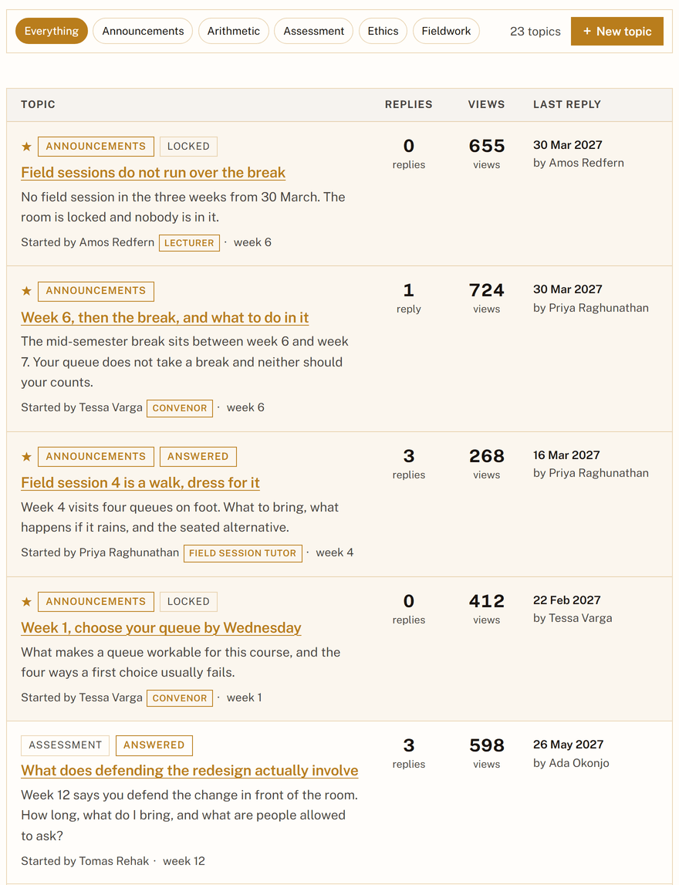
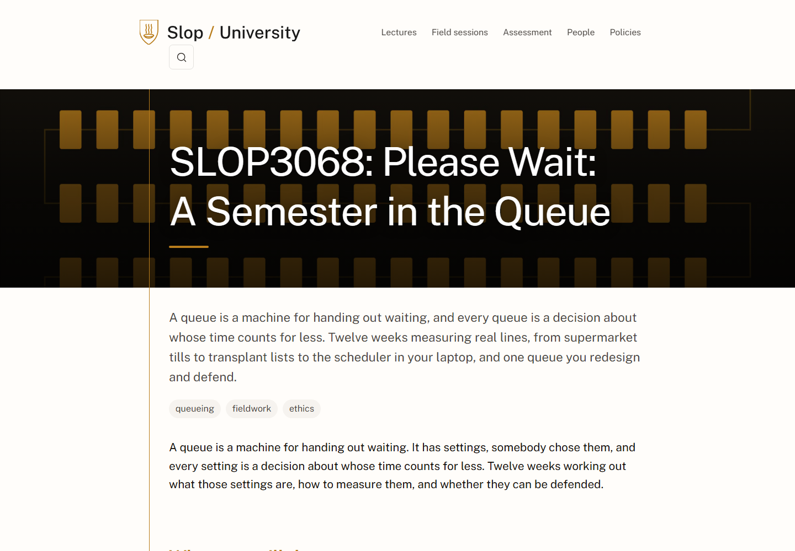
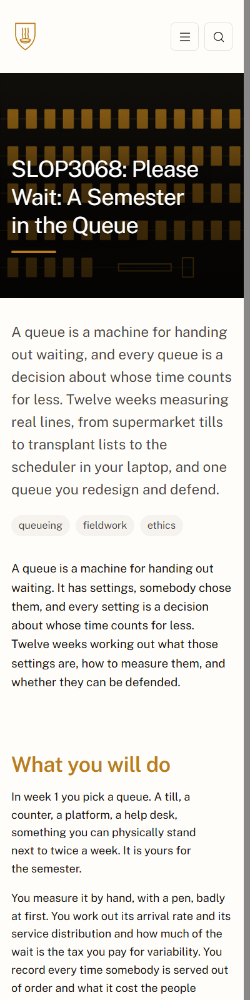

# Process overview

## What I built

I built SLOP3068, *Please Wait: The Design and Politics of Waiting*, a twelve week course around one idea, that a queue is a machine for handing out waiting and every queue is a decision about whose time counts for less. I made the course around the assessment where students pick a real queue in week 1, measures it by hand over the semester, and in week 12 defends one change to it to the room which give them an idea on how to improve their queue and back it up. The site is sixty-seven pages: twelve lectures, twelve field sessions, four assessments, a twenty-three thread forum, a generated timetable, and a week 2 deck.

## How I got here

Before writing any content I thought about what makes a good university course. The ones I kept coming back to, Calling Bullshit, How to Make (Almost) Anything and CS 007, share nothing in subject or tone but each hold one claim for a whole semester instead of surveying a field. A good course also has to be honest about what it asks of the student, so I put four positions into `CLAUDE.md` and noted for each whether I would enforce it with a check in `spec/` or carry it myself
([`610a4a6`](https://github.com/comp4020-agentic-coding-studio/comp4020-ass2-PressJump/commit/610a4a6)).

The position I would defend the hardest is that the assessment is the curriculum, so I wrote the four briefs before a single lecture
([`cd448b4`](https://github.com/comp4020-agentic-coding-studio/comp4020-ass2-PressJump/commit/cd448b4))
and the weeks exist to make them possible. The check protecting this is `needs:`
([`5cbb4a9`](https://github.com/comp4020-agentic-coding-studio/comp4020-ass2-PressJump/commit/5cbb4a9)),
where every assessment lists the lectures it depends on and the build fails if one lands on or after the due date. The position I care about most is that every week has to add a capability, and there is no honest way to test that, so `CLAUDE.md` says that judgement is mine. Writing every session to a fixed shape helped more than a test, and a Bring heading and a What leaves the room heading on each one killed three sessions I had drafted
([`e1ca8be`](https://github.com/comp4020-agentic-coding-studio/comp4020-ass2-PressJump/commit/e1ca8be)).

Then I went through the Slop University site the repo came with [1] and thought to myself, if I were attending this course, what would I go looking for: when everything is on, what is due, what happens if I get sick. So I added a timetable with a calendar you can page through [2]
([`a5548d1`](https://github.com/comp4020-agentic-coding-studio/comp4020-ass2-PressJump/commit/a5548d1)),
an extension form that confirms in the page [3]
([`387704b`](https://github.com/comp4020-agentic-coding-studio/comp4020-ass2-PressJump/commit/387704b)),
a glossary, and a forum laid out like one people use [4]
([`d1c549e`](https://github.com/comp4020-agentic-coding-studio/comp4020-ass2-PressJump/commit/d1c549e)).
The nav got long so I grouped it into named collapsible menus
([`714c353`](https://github.com/comp4020-agentic-coding-studio/comp4020-ass2-PressJump/commit/714c353)).

Assignment 1 taught me to let a reader work something out rather than read about it, so instead of explaining Little's Law [5] I built the home page around a calculator the student drives
([`e3b60c0`](https://github.com/comp4020-agentic-coding-studio/comp4020-ass2-PressJump/commit/e3b60c0)),
with tables, callouts, pull quotes and a weight bar around it
([`3b46ab0`](https://github.com/comp4020-agentic-coding-studio/comp4020-ass2-PressJump/commit/3b46ab0)).

The writing was what the checks could not reach. spec/voice.test.ts stayed green while the text the agent had written still unfortunately read like agent slop. Reading through the site, everything came out as flat statements one after the other, litterally it was just statement slop, the kind of writing that is technically correct but its very direct and contains no softening and nobody in real life every say or write. I personally believe a course site should sound like a person and give clear directions as to push students for better learning soft guidence is incredibly important. So I went through and made it more personal, adding in the filler words and asides a lecturer would actually use when talking to a student which removed that slop feel
([`b905f35`](https://github.com/comp4020-agentic-coding-studio/comp4020-ass2-PressJump/commit/b905f35))
and cut writing that sounds impressive and says nothing which is very common in agent written text
([`38fa27b`](https://github.com/comp4020-agentic-coding-studio/comp4020-ass2-PressJump/commit/38fa27b)).

### How I knew the result was right

I planted four bugs and watched each fail its own test. The rest I found by clicking around myself. The navigation was missing on every page I reached by clicking a link but came back if I reloaded. After a good amount of debugging, it turned out the theme had Astro's `<ClientRouter>` [6] turned on, so a link click swaps the document in place and a module script runs once per URL, leaving the nav grouping, calendar paging, calculator and both forms dead. The fix bound every script to `astro:page-load`
([`63961a9`](https://github.com/comp4020-agentic-coding-studio/comp4020-ass2-PressJump/commit/63961a9)).
Every check stayed green throughout, because the shipped HTML is identical either way. Every real defect I found by clicking, not by reading the diff which showed me the importance of testing by hand than relying on green testing checkmarks all the time.

## References

1. [Slop University](https://slop.university/).
2. [Semester timetable](https://comp4020-agentic-coding-studio.github.io/comp4020-ass2-PressJump/timetable/).
3. [Extension request](https://comp4020-agentic-coding-studio.github.io/comp4020-ass2-PressJump/extensions/).
4. [Course forum](https://comp4020-agentic-coding-studio.github.io/comp4020-ass2-PressJump/forum/).
5. Little, J. D. C. (1961). [A Proof for the Queuing Formula: L = λW](https://doi.org/10.1287/opre.9.3.383). *Operations Research* 9(3).
6. [View transitions](https://docs.astro.build/en/guides/view-transitions/), Astro docs.
