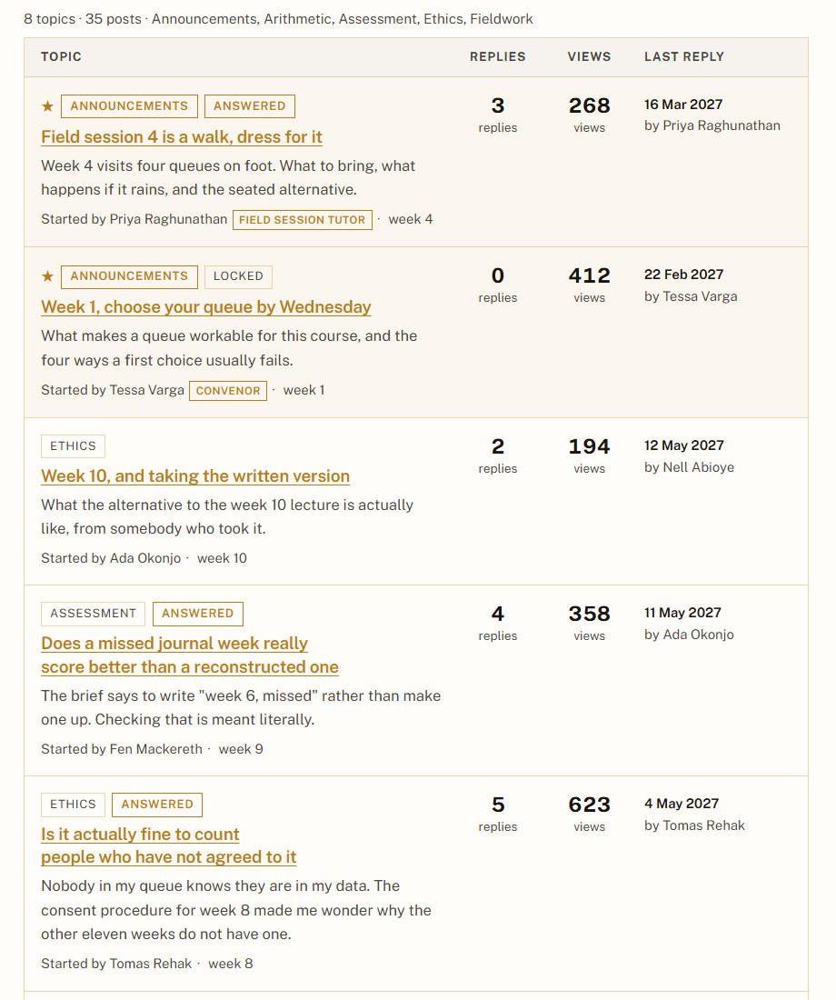
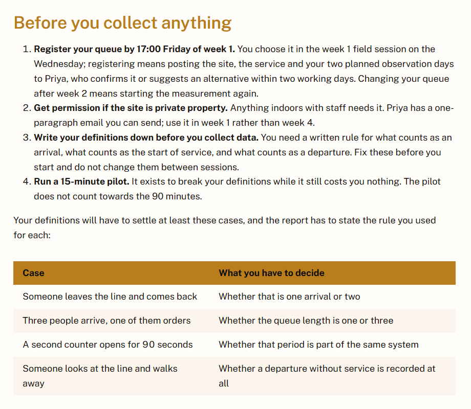

# Assignment 2 reflection

## What was the breakthrough that moved the work forward?

I started with the Slop University site the repo came with [1]. The
structure was there and some of it was good. Then I thought about what I would
want as a student, when classes are on, what is due and what to do if I get
sick. Most was missing, so I added it. A semester
timetable with a calendar you can page through [2], an extension request form
that confirms in the page [3], a glossary, and a course forum laid out like one
people use [4]
([`3654ce4`](https://github.com/comp4020-agentic-coding-studio/comp4020-ass2-PressJump/commit/3654ce4)).

The nav got long, so I grouped it into named collapsible
menus, letting several pages sit under one topic instead of one long row
([`79f1c25`](https://github.com/comp4020-agentic-coding-studio/comp4020-ass2-PressJump/commit/79f1c25)).

I also wanted the site to show things rather than only say them. Assignment 1
taught me to let a reader work something out rather than read about it, so
instead of explaining Little's Law [5] I built the home page
around a calculator the student drives. Around it I added components for tables,
callouts, pull quotes and a weight bar
([`2c3b5ab`](https://github.com/comp4020-agentic-coding-studio/comp4020-ass2-PressJump/commit/2c3b5ab)).

In the development of all these additions I tested the application to make sure
everything was working correctly, and testing it myself is how I found many bugs
that the agent could not detect. Like for example, the navigation was missing
on every page I reached by clicking a link, but it came back if I reloaded said page.
After a good amount of debugging, apparently the theme had Astro's
`<ClientRouter>` [6] turned on, so a link click swaps the document in place
instead of reloading the page, and Astro runs a module script once per URL.
Anything that set itself up at parse time ran on the first load and never again.
That left five things dead, the nav grouping, the calendar paging, the
calculator and both forms
([`112d671`](https://github.com/comp4020-agentic-coding-studio/comp4020-ass2-PressJump/commit/112d671)).
The fix was binding every script to `astro:page-load`, and making setup
idempotent because that event fires on first load too. Even though this bug
literally existed and the agent was looking at the page, every check stayed
green throughout, because the HTML that ships is identical either way, which is why
nothing automated could catch it and the agent running could not detect what was
wrong.

## What did this work change about who I want to be as a software developer?

This assignment changed my perspective in a way where I used to treat software
as something you build and verify, and now as something you stand inside as the
person using it. Putting yourself in your user's shoes is the part no tool does
for you.

First, I want to review an agent's work by using it rather than reading the
diff, since every defect I found here I found by clicking, and there were
bugs that the agent could not detect, which showed me the importance of manual
testing even if tests pass green on a UI.

Second, I want to push back on writing that sounds impressive and says nothing,
because AI can write a lot of slop that adds up to nothing
([`d3031e8`](https://github.com/comp4020-agentic-coding-studio/comp4020-ass2-PressJump/commit/d3031e8)).

Third, the simpler something is to see, the better it is understood. A table or
a callout does more for a reader than another paragraph.

Testing the site as the student it was for changed me as a developer, because
now I will click through what I build
before trusting it, cut writing that says nothing, and reach for interactive UI
that lets a user control their learning and visualise the point.

## References

1. [Slop University](https://slop.university/), the starter university.
2. [Semester timetable](https://comp4020-agentic-coding-studio.github.io/comp4020-ass2-PressJump/timetable/).
3. [Extension request](https://comp4020-agentic-coding-studio.github.io/comp4020-ass2-PressJump/extensions/).
4. [Course forum](https://comp4020-agentic-coding-studio.github.io/comp4020-ass2-PressJump/forum/).
5. Little, J. D. C. (1961). [A Proof for the Queuing Formula: L =
   λW](https://doi.org/10.1287/opre.9.3.383). *Operations Research*, 9(3),
   383-387.
6. [View transitions](https://docs.astro.build/en/guides/view-transitions/),
   Astro documentation.
